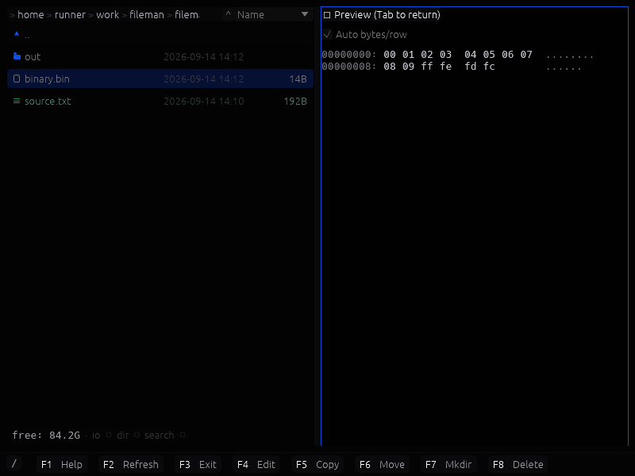

# FileMan

FileMan is a fast, responsive two-panel file manager built with Rust, egui, and blade-egui. Navigation stays snappy even in large directories by doing all I/O off the UI thread and streaming results into the view.



## Features
- **Dual-panel layout** with independent navigation, history (Alt+Left/Right), panel swap (Ctrl+U), and tab support.
- **Async I/O** — directory loading streams in batches; all I/O runs off the UI thread so navigation never stalls.
- **SFTP remote browsing** — connect to any SSH host (reads `~/.ssh/config`), navigate and operate on remote files as naturally as local ones.
- **Remote search** (Alt+F7 on a remote panel) — runs `find` or `grep` over SSH; results stream back and open directly.
- **Archive navigation** for zip, tar, tar.gz, and tar.bz2 — browse like regular folders, copy files out, or open with system apps.
- **Preview** (F3): text with syntax highlighting, images (JPEG, PNG, GIF, WebP, BMP, TGA, HDR, DDS) including animated GIF, and archive listings.
- **Inline editor** (F4) with syntax highlighting; create new files with Shift+F4.
- **File operations**: copy (F5), move (F6), delete (F8), rename (Shift+F6), new directory (F7) — all work on local and remote panels, with a progress bar for large transfers.
- **Search** (Alt+F7) by name or content, with wildcard and case-insensitive options; results displayed as a virtual folder you can navigate and operate on.
- **Theming**: external theme files in `themes/` (JSON, YAML, or TOML), toggle with F9, pick with F10.

## Install

Grab a build for your platform from the [latest release](https://github.com/navigato-rs/fileman/releases/latest):

| Platform | Download | Notes |
|----------|----------|-------|
| macOS (Apple Silicon) | `fileman-macos-aarch64.dmg` | Open it and drag FileMan to Applications |
| Windows | `fileman-*-x86_64.msi` | Installer with a Start Menu entry |
| Debian/Ubuntu | `fileman_*_amd64.deb` | `sudo dpkg -i fileman_*_amd64.deb` |
| Fedora/RHEL | `fileman-*.x86_64.rpm` | `sudo rpm -i fileman-*.x86_64.rpm` |
| Linux (portable) | `fileman-linux-x86_64.AppImage` | `chmod +x` and run |

The `-gles` Linux builds use the OpenGL ES backend — use them if the default
Vulkan build reports `NoSupportedDeviceFound`.

Install new versions through your package manager or the Releases link in Help
(F1). Fileman does not check for updates or replace its executable.

If macOS reports that the app is damaged or that Apple cannot check it for
malicious software, that release was built without notarization credentials.
Clear the download quarantine to run it anyway:
```bash
xattr -dr com.apple.quarantine /Applications/FileMan.app
```

## Keyboard Shortcuts
| Key | Action |
|-----|--------|
| Enter | Open |
| Shift+Enter | Open with system default app |
| Tab | Switch panels |
| Ctrl+U | Swap panels |
| Ctrl+T | New tab |
| Ctrl+W | Close tab |
| Ctrl+Tab / Ctrl+Shift+Tab | Next / previous tab |
| Alt+Left / Alt+Right | Back / forward |
| Backspace / Ctrl+PgUp | Parent folder |
| Ctrl+PgDn | Open selected |
| Ctrl+Left / Ctrl+Right | Open selected dir in other panel |
| F1 | Help |
| F2 / Ctrl+R | Refresh |
| F3 | Preview |
| Ctrl+F | Find in preview |
| F4 | Edit |
| Shift+F4 | New file |
| Alt+F5 | Pack (create archive) |
| F5 | Copy |
| F6 | Move |
| Shift+F6 | Rename |
| F7 | New directory |
| Alt+F7 | Search by name |
| Shift+Alt+F7 | Search by content |
| F8 | Delete |
| F9 | Toggle theme |
| F10 | Theme picker |
| Insert / Ctrl+I | Mark / unmark |
| Space | Compute folder size |
| Alt+Enter | Properties |
| Ctrl+G | Quick jump |
| Ctrl+Shift+C | Copy path to clipboard |
| Ctrl+, | Settings |

## Build and Run
```bash
cargo build --release
cargo run --release
```

Open in a specific directory:
```bash
cargo run --release -- /path/to/dir
```

Enable verbose logging:
```bash
RUST_LOG=info cargo run
```

### GPU Backend Notes
If you see `NoSupportedDeviceFound`, blade-graphics couldn't find a supported GPU backend.
On Linux, this usually means Vulkan drivers aren't available. You can either install Vulkan
drivers or use the GLES fallback:
```bash
RUSTFLAGS="--cfg gles" cargo run
```

## Desktop integration

```sh
make install
```

On Linux this puts the binary, `.desktop` entry, and icon under `~/.local`, so
FileMan appears in the application menu. On macOS it also writes
`~/Applications/FileMan.app` (Launchpad and Spotlight); a `.desktop` file is
not a macOS launcher. `$(PREFIX)/bin` is on the PATH in both cases.

To install system-wide instead (`/usr` on Linux, `/Applications` on macOS):

```sh
sudo make install PREFIX=/usr
```

To remove:

```sh
make uninstall
```

## Contributing
See [CONTRIBUTING.md](CONTRIBUTING.md) for repository layout, testing, and code style.

Feedback and private diagnostics: [privacy and reporting](PRIVACY.md).
